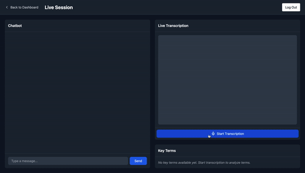

<p align="center">
        
</p>

<h1 align="center">Quotia</h1>

<p align="center">
        Quotia simplifies complex medical terms in doctor-patient conversations, helping patients understand jargon and ask follow-up questions.
</p>

## In Action

<p align="center">
        
</p>

## Features

- **Live Transcription**: Real-time transcription.
- **Term Simplification**: Simplifies medical terms.
- **Follow-up Questions**: Enables follow-up questions.
- **PDF Summaries**: Generates visit summaries in PDF.

## How It Works

1. **Transcription**: Real-time transcription.
2. **Simplification**: Simplifies medical terms.
3. **Questions**: Chatbot answers follow-up questions.
4. **PDF**: Generates visit summaries in PDF.

## Getting Started

### Prerequisites

- Node.js
- npm
- Python
- Go

### Installation

1. Clone the repository:
        ```sh
        git clone https://github.com/sharvillimaye/Quotia.git
        cd Quotia
        ```

2. Install client dependencies:
        ```sh
        cd client
        npm install
        ```

3. Install server dependencies:
        ```sh
        cd ../server
        go mod tidy
        ```

4. Set up environment variables:
        ```sh
        cp .env.example .env
        ```

### Running the Application

1. Start the client:
        ```sh
        cd client
        npm run dev
        ```

2. Start the server:
        ```sh
        cd ../server
        go run main.go
        ```

## Usage

- Navigate to `http://localhost:3000`.
- Start a live session.
- Ask follow-up questions.
- Download visit summaries in PDF.

## Contributing

Contributions are welcome! See the [contributing guidelines](CONTRIBUTING.md).

## License

Licensed under the MIT License. See the [LICENSE](LICENSE) file.
